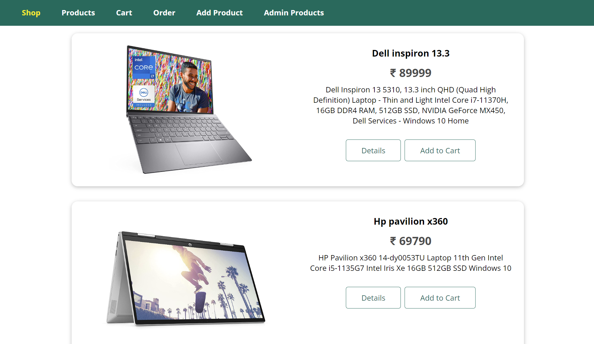
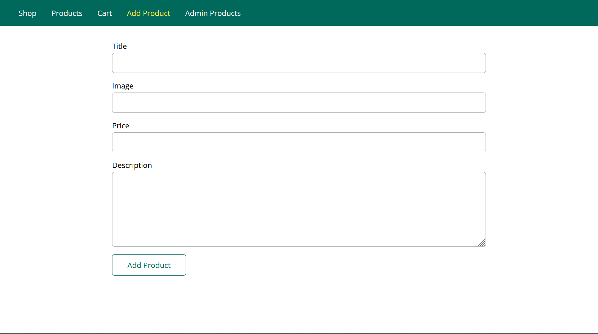

# Shopping WebApp

---

- A Fully function shopping app where you can add your products and also display the product to the client.
- This webapp is created using:
  1. Node.Js
  2. Express.Js
  3. Typescript
  4. EJS
  5. CSS

# Setup

---

- First you should have the node.js in your machine, if not then install the node by using this **[link](https://nodejs.org/en/download/)**
- Second, clone this repository into your machine,
  ```
  git clone https://github.com/sadiqhasanrupani/Shopping-WebApp-ExpressJs.git
  ```
- Third, After cloning type in the console like this,
  ```
  npm install
  ```
- Fourth, Now type,
  ```
  npm start
  ```
- After doing this you get the result in your console like this,
  
- Now search `http://localhost:8080` on your browser.

# Screenshots

---

## Medium Screens

---


